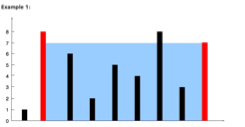

# Tournament winner


| Id | Title          | Source     | Data Structure | Algo Concept | Difficulty | Time Complexity | Space Complexity |
|----|----------------|------------|----------------|--------------|------------|-----------------|------------------|
| 1  | Two number sum | AlgoExpert | arrays         | Two pointers | easy       |

```python 
def tournament_winner(competitions, results):
    table=dict()
    for teams in competitions:
        for name in teams:
            table[name]=0
    for competition,outcome in zip(competitions,results):
        winner=get_winner(competition,outcome)
        table[winner]+=3
    league_winner=max(table,key=table.get)
    return league_winner

def get_winner(teams, result):
    if result ==0:
        return teams[1]
    else:
        return teams[0] 
```

### Key code insights

```python max(table,key=table.get) ``` wil return the key associated with the maximum value


# Move element to end.
https://www.algoexpert.io/questions/move-element-to-end

| Id | Title               | Source     | Data Structure | Algo Concept | Difficulty | Time Complexity | Space Complexity |
|----|---------------------|------------|----------------|--------------|------------|-----------------|------------------|
| 4  | Move Element To End | AlgoExpert | array          | Two pointers | easy       |

```python
def moveElementToEnd(array, toMove):
    pointer=0
    for i in range(len(array)):
        if array[i]!=toMove:
            array[pointer],array[i]=array[i],array[pointer]
            pointer+=1
    return array
```

# First duplicated value
| Title                 | Source     | Data Structure | Algo Concept | Difficulty | Time Complexity | Space Complexity |
|-----------------------|------------|----------------|--------------|------------|-----------------|------------------|
| First Duplicate Value | AlgoExpert | array          | hash set     | easy       | O(n)            | O(n)             |


```python
def firstDuplicateValue(array):
    seen=set()
    for num in array:
        if num in seen:
            return num
        else:
            seen.add(num)
    return -1
```

### Key code insights
* Alternative approach would be with hash map but the solution above seems to be more elegant

# Containers With Most Water.

| Title                       | Source   | Data Structure | Algo Concept         | Difficulty | Time Complexity | Space Complexity |
|-----------------------------|----------|----------------|----------------------|------------|-----------------|------------------|
| Containers With Most Water. | LeetCode | array          | Two pointers, greedy | Medium     |



* Input: ```height = [1,8,6,2,5,4,8,3,7]```
* Output: $49$
* Explanation: The above vertical lines are represented by array ```[1,8,6,2,5,4,8,3,7]```. In this case, the max area of water (blue section) the container can contain is $49$.

```python
def maxArea(self, height: List[int]) -> int:
        left=0
        right=len(height)-1
        max_area=0
        width=right-left
        while left<right:
            max_area=max(max_area,min(height[left],height[right])*width)
            if height[left]<=height[right]:
                left+=1
                width-=1
            else:
                right-=1
                width-=1
        return max_area 
```
### Key code insights
* we start from both sides.

* The reason for taking the minimum is that the area of water that can be trapped between the two lines is limited by the shorter of the two lines. The taller line won’t affect the maximum area because the shorter one is the limiting factor in determining how much water can be held.
* ```width-=1```each iteration narrow container 

# High five
https://leetcode.com/problems/high-five/description/?envType=company&envId=goldman-sachs&favoriteSlug=goldman-sachs-thirty-days

recently asked in Goldman Sachs
| Title     | Source   | Data Structure | Algo Concept                    | Difficulty | Time Complexity | Space Complexity |
|-----------|----------|----------------|---------------------------------|------------|-----------------|------------------|
| High Five | LeetCode | Array/dict     | Create dictionary from 2D array | easy       | O(nlogk)        | O(n)             |

Regarding time complexity k is the average number of scores per ID, m is unique Ids, n total number of scores. The dominant term depends on  n  and  m :
* In most cases,  $m \ll n$ , so  $O(n \log k)$  dominates.
```python 
def top_five_average(marks, threshold=5):
    return sum(marks[:threshold]) // threshold

def high_five(items: List[List[int]]) -> List[List[int]]:
    performance_dict = {}
    results=[]
    for item in items:
        if item[0] not in performance_dict:
            performance_dict[item[0]] = [item[1]]
        else:
            performance_dict[item[0]].append(item[1])
    for key in performance_dict:
        performance_dict[key].sort(reverse=True)
        results.append([key,top_five_average(performance_dict[key])])
    results_sorted=sorted(results,key=lambda x:x[0])
    return results_sorted
```